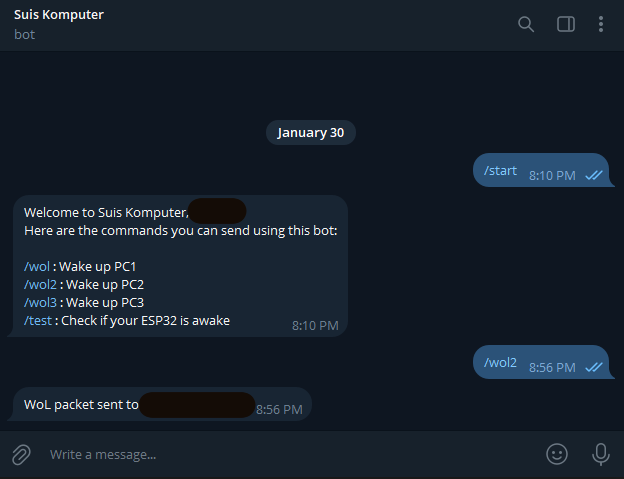

<div align="center"> 
  
# WoL Telegram Bot for LoLin32 Lite

Turn on multiple computers in your house from anywhere in the world using only a LoLin32 Lite, a cheap ESP32 board, controlled by Telegram.



</div>
  
## Description

I've always wanted an easy way to turn on my desktop and my laptop when I'm out. This is a simple code that made it possible for me to turn on multiple PCs using a cheap ESP32 board I already own, a Wemos LoLin32 Lite. This board can be bought for only around RM8 (2USD).

It works by sending a Wake-on-Lan magic packet to PCs in your house. The board will need to  be powered on and connected to your home Wi-Fi. It is then activated by Telegram when a command is sent by you.

## Getting Started

### Dependencies

* A Wemos LoLin32 Lite board.
* Telegram.
* A Telegram bot already set up using [Botfather](https://www.youtube.com/watch?v=UQrcOj63S2o).
* Visual Studio Code to compile the code and flash your Lolin2 Lite. You can use another software like Arduino IDE but make sure to install the correct dependencies.

### Installing

* Clone the code into Visual Studio Code. 
* PlatformIO will automatically install drivers for the board and library dependencies. If using another IDE, please install them manually.
* Paste your 2.4Ghz Wi-Fi SSID, Wi-Fi Password, Telegram Bot Token from Botfather, [Your Telegram Chat ID](https://www.alphr.com/find-chat-id-telegram/) and your [PC(s) MAC Address(es)](https://oit.ua.edu/article/finding-your-mac-address/#:~:text=Alternatively%2C%20press%20the%20Windows%20Key,Fi%20next%20to%20Physical%20Address.) in this part of the code in main.cpp:

```
const char* ssid = "Wifi_ID";
const char* password = "Password";
#define BOTtoken "GeneratedBotToken"  
#define CHAT_ID "18364519"
#define MAC_ADDR "05:A9:7F:EE:F8:C8" 
#define MAC_ADDR2 "0F:A9:BF:DE:38:18"
#define MAC_ADDR3 "A5:EF:2F:3E:F8:C1"
```

* Connect your LoLin32 Lite to your PC and flash the board.

### Usage

* With the LoLin32 Lite powered on, send a ```/start``` command to your Telegram bot. This will bring up the menu on what you can do with the bot:
* With your PC turned off and WoL feature enabled in the motherboard, send  ```/wol```,```/wol2``` or ```/wol3``` to turn on whichever PC you want.  

## Acknowledgments

* [daniele-salvagni](https://github.com/daniele-salvagni/wol-bot-esp32?tab=readme-ov-file) - Inspiration came from this project.
* My brother - Taught me the basics of VSCode and how to upload my code to GitHub.
